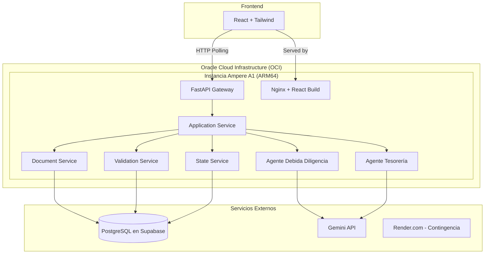
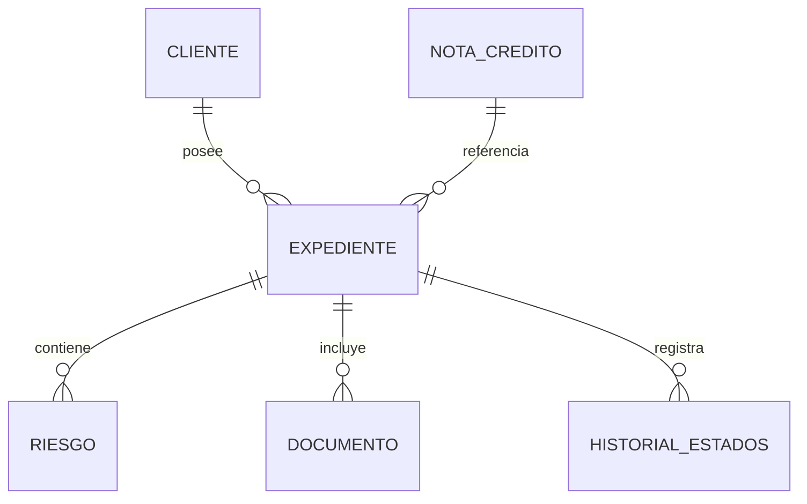

# Arquitectura del Sistema y Modelo de Datos

Este documento detalla las capas del sistema, el stack tecnológico, el pipeline de extracción de documentos, los diagramas y el modelo de datos relacional.

---

## 1. Arquitectura del Sistema

### 1.1. Stack Tecnológico

| Capa | Tecnología |
|------|------------|
| Frontend | React + TypeScript + Tailwind CSS |
| Backend API | Python + FastAPI |
| Base de Datos | PostgreSQL (Supabase o Neon.tech) |
| Tareas Asíncronas | FastAPI BackgroundTasks |
| Almacenamiento | Directorio local `/uploads` |
| LLM | Google Gemini API (uso de `response_mime_type="application/json"`) |
| Autenticación | Mock Auth (selector de roles en frontend) |
| Comunicación en Tiempo Real | HTTP Polling (GET /estado cada 3s) |
| Infraestructura | Oracle Cloud Infrastructure (OCI) – Instancia Ampere A1 (ARM64) |
| Plan de Contingencia | Render.com (Web Service, 512MB RAM) |

### 1.2. Estructura de Capas

```
Frontend (React + Tailwind)
        │
        ▼
API Gateway (FastAPI)
        │
        ▼
Application Service (Orquestador)
        │
        ├── Agente de Debida Diligencia (Gemini prompt especializado)
        ├── Agente de Tesorería (Gemini prompt especializado)
        ├── Document Service (extracción, versionado)
        ├── Validation Service (reglas, riesgos)
        ├── Risk Service (detección, clasificación)
        └── State Service (transiciones)
        │
        ▼
Repositorios (SQLAlchemy)
        │
        ▼
PostgreSQL (Supabase)
```

### 1.3. Integración con Sistemas Empresariales

El sistema se integraría con sistemas empresariales existentes mediante los siguientes mecanismos:

- **Webhooks de Salida:** Cuando un expediente alcanza el estado `CERRADO`, el sistema envía un webhook HTTP al CRM o Core Bursátil de la Casa de Valores con el JSON completo del expediente.
- **API REST:** El sistema expone endpoints para que sistemas externos (ej. plataforma de Bolsa) consulten el estado de expedientes y documentos.
- **Exportación de Datos:** Los expedientes cerrados pueden exportarse en formato JSON/CSV para su ingesta en sistemas de contabilidad o auditoría.

---

## 2. Modelo de Datos

### 2.1. Tablas (6 tablas)

**`cliente`**
- id: UUID (PK)
- ruc: String(13), único
- razon_social: String
- estado_ruc: Enum (ACTIVO, SUSPENDIDO)
- datos_kyc: JSONB
- created_at: DateTime

**`nota_credito`**
- id: UUID (PK)
- numero_autorizacion: String, único
- ruc_beneficiario: String(13)
- valor_nominal: Decimal
- saldo_disponible: Decimal
- tipo: Enum (NCD, NCD_ISD)
- historial_endosos: JSONB
- created_at: DateTime

**`expediente`**
- id: UUID (PK)
- cliente_id: UUID (FK → cliente)
- nota_id: UUID (FK → nota_credito)
- estado: Enum (8 estados)
- monto_a_negociar: Decimal
- responsable: String
- created_at: DateTime
- updated_at: DateTime

**`documento`**
- id: UUID (PK)
- expediente_id: UUID (FK → expediente)
- tipo: Enum (CEDULA, PAPELETA, CERTIFICADO, PLANILLA, KYC, CESION, NOTA)
- version: Integer
- storage_path: String
- hash_sha256: String
- es_activo: Boolean
- created_at: DateTime

**`riesgo`**
- id: UUID (PK)
- expediente_id: UUID (FK → expediente)
- descripcion: Text
- nivel: Enum (CRITICO, ALTO, MEDIO, BAJO)
- estado: Enum (ABIERTO, RESUELTO)
- evidencia: JSONB
- created_at: DateTime

**`historial_estados`**
- id: UUID (PK)
- expediente_id: UUID (FK → expediente)
- estado_anterior: Enum
- estado_nuevo: Enum
- usuario: String
- comentarios: Text
- created_at: DateTime

### 2.2. Inicialización de la Base de Datos

Para evitar configuraciones complejas de migraciones, se inicializa la base de datos al inicio de la aplicación con SQLAlchemy:

```python
# app/main.py
from app.database import Base, engine

@app.on_event("startup")
def startup_db_client():
    Base.metadata.create_all(bind=engine)
```

---

## 3. Diagramas

### 3.1. Arquitectura del Sistema (Con Dos Agentes e Infraestructura OCI)



### 3.2. Modelo de Datos Relacional


