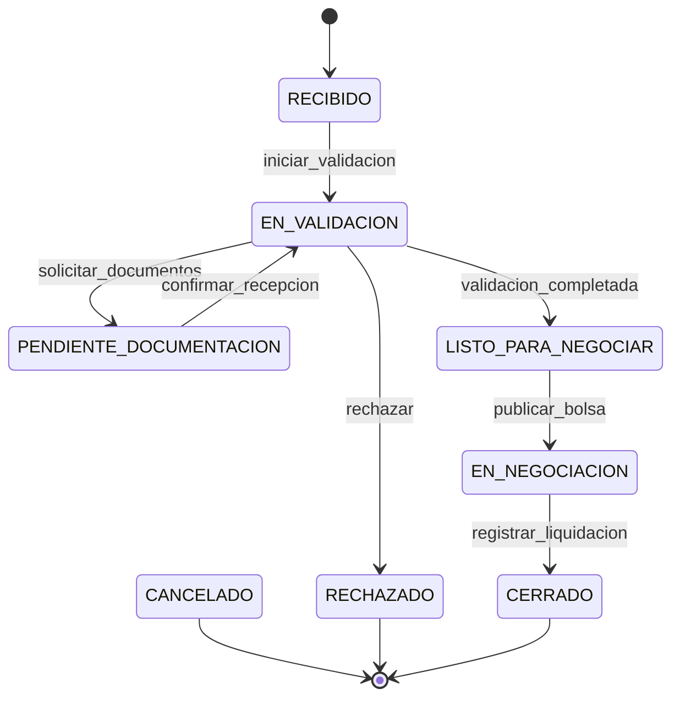

# Estados, Transiciones y Reglas de Negocio

Este documento define el comportamiento operacional, la máquina de estados y las reglas de consistencia de negocio del sistema.

---

## 1. Definición de Estados del Expediente

| Estado | Descripción |
|--------|-------------|
| `RECIBIDO` | Expediente creado, documentos cargados. |
| `EN_VALIDACION` | En proceso de validación. |
| `PENDIENTE_DOCUMENTACION` | Falta documentación obligatoria. |
| `LISTO_PARA_NEGOCIAR` | Todos los requisitos cumplidos. |
| `EN_NEGOCIACION` | Orden publicada en Bolsa de Valores. |
| `CERRADO` | Finalizado y archivado (estado terminal). |
| `RECHAZADO` | Denegado por cumplimiento (estado terminal). |
| `CANCELADO` | Cancelado por operador/cliente (estado terminal). |

### Tabla de Transiciones Permitidas

| Estado Origen | Evento / Acción | Estado Destino |
|---------------|-----------------|----------------|
| `RECIBIDO` | Iniciar validación | `EN_VALIDACION` |
| `EN_VALIDACION` | Solicitar documentos | `PENDIENTE_DOCUMENTACION` |
| `PENDIENTE_DOCUMENTACION` | Confirmar recepción | `EN_VALIDACION` |
| `EN_VALIDACION` | Validación completada | `LISTO_PARA_NEGOCIAR` |
| `EN_VALIDACION` | Rechazar | `RECHAZADO` |
| `LISTO_PARA_NEGOCIAR` | Publicar en Bolsa | `EN_NEGOCIACION` |
| `EN_NEGOCIACION` | Registrar liquidación | `CERRADO` |
| **Cualquier activo** | Cancelar | `CANCELADO` |

### Diagrama de Transición de Estados

---

## 2. Reglas de Negocio (RN)

| ID | Regla | Descripción |
|----|-------|-------------|
| **R1** | Saldo parcial | Permite negociar un monto menor o igual al saldo disponible del título. |
| **R2** | Precio de venta | El operador ingresa el precio final manualmente; la IA solo asiste recomendando rangos históricos. |
| **R3** | Aprobación humana | La IA es un copiloto de sugerencia; las transiciones y validaciones finales exigen acción humana. |
| **R4** | Antecedentes reutilizables | Se priorizan datos previos del mismo RUC de cliente. |
| **R5** | Precedencia de fuentes | Prioridad: Fuente oficial SRI > Fuente de bloqueos > CRM de Valores > Edición manual. |
| **R6** | Cambio de estado | El operador ejecuta y confirma el cambio de estado físico. |
| **R7** | Registro de riesgos | Todos los riesgos detectados e historial de sugerencias deben quedar en base de datos. |
| **R8** | Múltiples riesgos | Se muestran todos los riesgos existentes en la vista ordenados por criticidad. |
| **R9** | Niveles de criticidad | **Crítico:** Bloquea transición; **Alto:** Acción inmediata; **Medio:** Revisable; **Bajo:** Informativo. |
| **R10** | CERRADO en solo lectura | El expediente no admite ediciones ni cargas documentales tras alcanzar estado terminal. |
| **R13** | Duplicidad de casos | No se permite crear dos expedientes activos con el mismo número de autorización. |
| **R14** | Monto a negociar | Mayor a cero y menor o igual al saldo disponible de la Nota de Crédito. |
| **R15** | Acciones de cumplimiento | Oficial de cumplimiento aprueba, rechaza (con comentarios) o solicita documentación adicional. |
| **R16** | Requisitos Listo Negociar | Requiere documentación cargada, título validado, endosos válidos y cero riesgos Críticos abiertos. |
| **R22** | Versionado de documentos | Los documentos antiguos no se eliminan físicamente; se versionan autoincrementalmente. |
| **R23** | Campos inmutables | El número de autorización y RUC no se editan una vez confirmados. |
| **R24** | Consistencia cronológica | Las fechas de endoso y emisión deben seguir una secuencia cronológica coherente. |
| **R29** | Vista de enfoque | Ocultar riesgos informativos (Bajos) si hay riesgos Críticos o Altos presentes en pantalla. |

---

## 3. Catálogo de Mensajes del Sistema

| Código | Mensaje Técnico |
|--------|-----------------|
| **MSG-01** | `"Datos extraídos correctamente. Revise y confirme."` |
| **MSG-02** | `"El campo [nombre] es obligatorio. Por favor, ingréselo manualmente."` |
| **MSG-05** | `"No se pudo conectar con la fuente de validación. Se requiere validación manual."` |
| **MSG-06** | `"Riesgo Crítico: [descripción]. Se requiere acción inmediata."` |
| **MSG-07** | `"Riesgo Alto: [descripción]. Se sugiere revisión."` |
| **MSG-08** | `"Riesgo Medio: [descripción]. Revise si es aplicable."` |
| **MSG-09** | `"Riesgo Bajo: [descripción]. Informativo."` |
| **MSG-10** | `"El monto a negociar debe ser mayor a cero y menor o igual al saldo disponible."` |
| **MSG-15** | `"El RUC actual no coincide con el último endosatario de la Nota de Crédito."` |
| **MSG-19** | `"Ya existe un expediente activo para esta nota de crédito."` |
