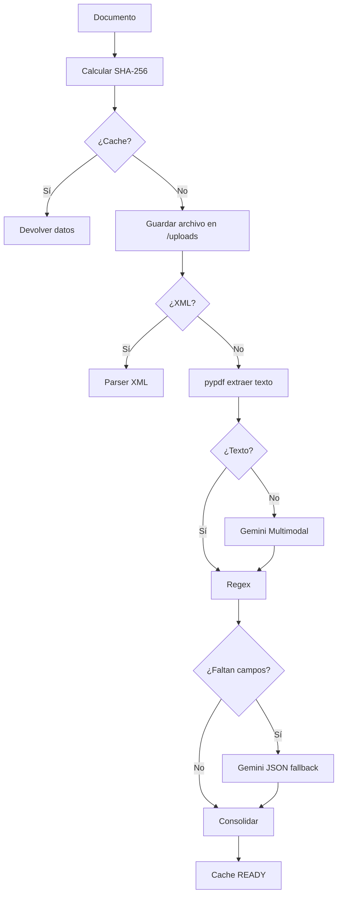

# Agentes de IA y Pipeline de Extracción

Este documento detalla el comportamiento técnico, los prompts estructurados de los agentes cognitivos y el pipeline de procesamiento de documentos.

---

## 1. Pipeline de Extracción de Documentos

El sistema procesa los archivos cargados de acuerdo al siguiente flujo lógico:



### Características del Pipeline:
1.  **Parseo Determinístico:** Los XML se procesan de forma inmediata en el servidor sin coste de tokens de IA usando parsers locales.
2.  **Extracción de PDF:** Si el PDF contiene texto, se aplica regex sobre el contenido extraído.
3.  **Llamada a Gemini (Multimodal):** Si no hay texto (documento escaneado), se envía el archivo a Gemini (usando el SDK oficial con `response_mime_type="application/json"`).
4.  **Uso Controlado:** Solo se llama a Gemini si falla la extracción determinística.

---

## 2. Agente de Debida Diligencia y Cumplimiento

Este agente se encarga de analizar los riesgos de cumplimiento, consistencia documental y vigencia para el Track 4 del mercado ecuatoriano.

### Código de Implementación de Referencia

```python
# app/services/compliance_agent.py
import json
from google import generativeai as genai

def analizar_riesgos_cumplimiento(datos_cliente: dict, datos_nota: dict, documentos_presentes: list) -> dict:
    """
    Este agente se encarga de analizar los riesgos de cumplimiento, consistencia 
    documental y vigencia para el Track 4 del mercado ecuatoriano.
    """
    model = genai.GenerativeModel("gemini-1.5-flash")
    
    prompt = f"""
    Eres el "Agente IA para Debida Diligencia y Cumplimiento" de una Casa de Valores en Ecuador.
    Tu objetivo es analizar un caso de negociación de Notas de Crédito Desmaterializadas (NCD) del SRI
    y devolver una lista estructurada de riesgos detectados de forma determinística.

    INFORMACIÓN DE ENTRADA:
    - Datos del Cliente: {json.dumps(datos_cliente)}
    - Datos de la Nota de Crédito: {json.dumps(datos_nota)}
    - Documentos Cargados en el Expediente: {json.dumps(documentos_presentes)}

    REGLAS DE NEGOCIO A EVALUAR:
    - R9 (Criticidad): Identifica riesgos Críticos (bloquean), Altos (acción inmediata), Medios (revisar) y Bajos (informativos).
    - R12 (Vigencia de Documentos): Papeleta de votación vigente 1 año, certificado bancario 3 meses, planilla de servicios 3 meses.
    - MSG-15 (Cadena de Endosos): Si el RUC del cliente no coincide con el último endosatario registrado en el historial de endosos de la nota, levanta riesgo CRÍTICO.

    Debes devolver un objeto JSON con la siguiente estructura exacta, sin texto adicional:
    {{
        "riesgos": [
            {{
                "nivel": "CRITICO" | "ALTO" | "MEDIO" | "BAJO",
                "descripcion": "Descripción detallada del riesgo en lenguaje natural",
                "regla_activadora": "ID_DE_LA_REGLA (ej: R12, MSG-15, R9)",
                "evidencia": "Justificación basada exactamente en los datos recibidos. No inventes datos."
            }}
        ]
    }}
    """
    
    response = model.generate_content(
        prompt,
        generation_config={"response_mime_type": "application/json"}
    )
    return json.loads(response.text)
```

---

## 3. Analista Financiero para Tesorería Digital

Este agente se encarga de verificar la viabilidad financiera del título, validar saldos para ventas parciales y generar sugerencias operativas.

### Código de Implementación de Referencia

```python
# app/services/treasury_agent.py
import json
from google import generativeai as genai

def sugerir_negociacion_y_orden(datos_nota: dict, monto_a_negociar: float) -> dict:
    """
    Este agente se encarga de verificar la viabilidad financiera del título,
    validar saldos para ventas parciales y generar sugerencias operativas.
    """
    model = genai.GenerativeModel("gemini-1.5-flash")
    
    prompt = f"""
    Eres el "Analista Financiero IA para Tesorería Digital" de una Casa de Valores en Ecuador.
    Tu objetivo es evaluar la viabilidad financiera de una Nota de Crédito Tributaria.

    INFORMACIÓN DE ENTRADA:
    - Datos de la Nota de Crédito: {json.dumps(datos_nota)}
    - Monto que el Cliente desea Negociar: {monto_a_negociar}

    REGLAS DE NEGOCIO A EVALUAR:
    - R1 (Saldo y Venta Parcial): El monto a negociar debe ser mayor a cero y menor o igual al saldo disponible.
    - R2 (Determinación de Precio): No puedes calcular ni proponer un precio final de venta. Debes sugerir referencias históricas de descuentos aplicables (ej: entre 5% y 8% para notas ordinarias; descuento mayor para NCD-ISD debido a menor liquidez).

    Debes sugerir la "Próxima Acción" recomendada para el operador.

    Debes devolver un objeto JSON con la siguiente estructura exacta:
    {{
        "viabilidad_financiera": {{
            "aprobado": true | false,
            "motivo_rechazo": "Explicación si el monto a negociar excede el saldo disponible de la nota"
        }},
        "sugerencia_tesoreria": {{
            "rango_descuento_sugerido": "Descripción del rango de descuento de mercado aplicable",
            "monto_nominal_negociable": {monto_a_negociar},
            "observaciones_liquidez": "Análisis de liquidez basado en el tipo de nota (NCD o NCD-ISD)"
        }},
        "proxima_accion": {{
            "codigo_accion": "PREPARAR_ORDEN" | "SOLICITAR_CORRECCION_MONTO" | "ENVIAR_CUMPLIMIENTO" | "VERIFICAR_ENDOSOS",
            "descripcion_sugerida": "Descripción corta de la acción sugerida para mostrar en la interfaz (RF-07)"
        }}
    }}
    """
    
    response = model.generate_content(
        prompt,
        generation_config={"response_mime_type": "application/json"}
    )
    return json.loads(response.text)
```
